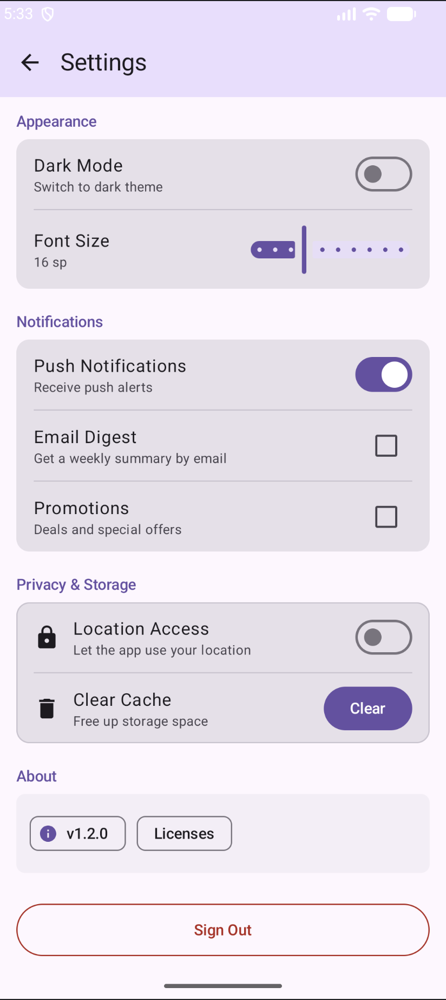

# Assignment 3 Question 1: Settings Screen

## Description
This project is a polished Android Settings screen built with Jetpack Compose. It demonstrates Row/Column layout mastery, extensive use of Compose Modifiers, and a variety of Material 3 components.

## Key Features

* **Structured Layout Mastery**: Utilizes a main `Column` container with precisely nested `Row` components to organize individual setting items with professional alignment.
* **Advanced Modifier Integration**: Demonstrates heavy use of `padding`, `fillMaxWidth`, and `Modifier.weight()` to ensure UI controls like Switches and Sliders align perfectly without truncation.
* **Interactive M3 Controls**: Features a wide array of Material 3 input components including `Switch` for toggles, `Slider` for range adjustments, and `Checkbox` for multi-selection.
* **Responsive Visual Styling**: Applies `clip`, `border`, and `background` modifiers to `Card` containers to provide a structured and modern look for different settings categories.
* **Comprehensive M3 Suite**: Incorporates 6+ Material 3 components such as `CenterAlignedTopAppBar`, `AssistChip`, `HorizontalDivider`, and `Button` to ensure platform consistency.

## Screenshots

## AI Disclosure
I used Google's Gemini AI to assist me with specific technical issues in this assignment:
1. **Debugging**: AI helped identify a missing comma syntax error and a package name mismatch (`com.example.settingsscreen` vs `com.example.a3_q1`) that caused a runtime crash.
2. **Material 3 API Migration**: AI advised replacing the deprecated `ButtonDefaults.outlinedButtonBorder` with `BorderStroke` to fix a compilation error.
3. **Rubric Verification**: AI helped cross-check my code against the grading rubric to ensure all required Modifiers (specifically `Modifier.align`) were explicitly demonstrated.
